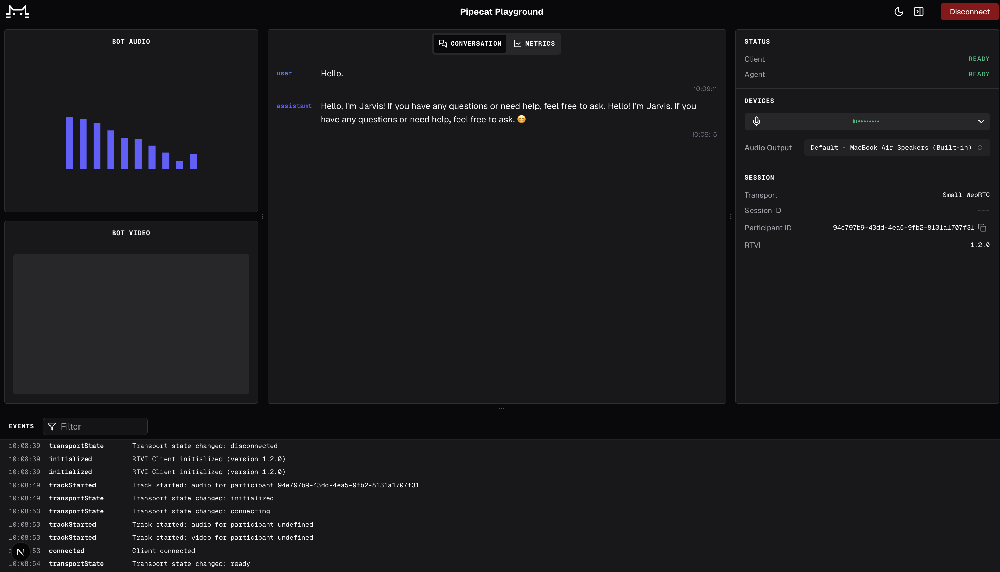

# Jarvis — Local voice agents on macOS with Pipecat



Pipecat is an open-source, vendor-neutral framework for building real-time voice (and video) AI applications.

This repository contains a voice agent ("Jarvis") that runs entirely with **local models on macOS**. On an M-series Mac, you can achieve voice-to-voice latency of <800 ms with relatively strong models.

The [server/bot.py](server/bot.py) pipeline uses these models by default:

- **VAD** — Silero VAD
- **Turn detection** — smart-turn v2
- **STT** — MLX Whisper (or Parakeet-MLX)
- **LLM** — an OpenAI-compatible local server (e.g. Qwen3 / Gemma3n via LM Studio)
- **TTS** — Kokoro (or Marvis) via [mlx-audio](https://github.com/Blaizzy/mlx-audio)

Any of these can be swapped out or reconfigured. All models and settings are driven by [`server/config.yaml`](server/config.yaml) (overridable via environment variables — see [`server/config.py`](server/config.py)).

The bot and web client communicate over a low-latency, local, serverless WebRTC connection. See the Pipecat [SmallWebRTCTransport docs](https://docs.pipecat.ai/server/services/transport/small-webrtc) for details.

## macOS push-to-talk

An optional native Quartz helper provides a system-wide hold-to-talk key,
defaulting to **Right Command (⌘)**. It gates audio before STT/VAD, so ambient
noise cannot start a turn while released. See [HOTKEY.md](HOTKEY.md) for setup,
macOS permissions, customization, and the Apple Silicon smoke-test checklist.

## Project structure

```
macos-local-voice-agents/
├── README.md                     # This file
├── .gitignore
│
├── assets/                       # Static assets used by docs
│   └── debug-console-screenshot.png
│
├── scripts/                      # One-command helper scripts (portable, repo-relative)
│   ├── setup_server.sh           # Create the Python 3.12 venv and install server deps
│   ├── start_llm.sh              # Start the local OpenAI-compatible LLM server (:1234)
│   ├── run_agent.sh              # Start just the Pipecat agent server (bot.py, :7860)
│   ├── start.sh                  # Bring up the FULL stack: LLM + agent + client
│   ├── stop.sh                   # Kill all Jarvis processes (:1234 / :7860 / :3000)
│   ├── test_components.sh        # Launch the STT/LLM/TTS component test UI (:8080)
│   └── smoke_test.sh             # Headless STT/LLM/TTS inference tests + timings
│
├── server/                       # Python voice-agent backend (Pipecat + MLX)
│   ├── bot.py                    # Main entry point — builds & runs the WebRTC voice pipeline
│   ├── bot.py.orig               # Original/reference version of bot.py
│   ├── config.py                 # Central config loader (env var > config.yaml > defaults)
│   ├── config.yaml               # Model & pipeline configuration (STT/LLM/TTS/VAD/turn)
│   │
│   ├── parakeet_stt.py           # Parakeet-MLX STT service (Pipecat SegmentedSTTService wrapper)
│   ├── tts_mlx_isolated.py       # Process-isolated MLX TTS service (avoids Metal threading conflicts)
│   ├── kokoro_worker.py          # Standalone Kokoro TTS worker process (JSON over stdin/stdout)
│   ├── marvis_worker.py          # Standalone Marvis TTS worker process (JSON over stdin/stdout)
│   │
│   ├── component_test_server.py  # Standalone web console to test STT/LLM/TTS independently
│   │
│   ├── pyproject.toml            # Project metadata & dependencies (uv)
│   ├── uv.lock                   # uv lockfile
│   ├── requirements.txt          # pip dependencies (alternative to uv)
│   ├── env.example               # Example environment file (API keys, optional)
│   ├── .gitignore
│   └── .venv/                    # Local virtual environment (generated, not committed)
│
└── client/                       # Next.js / React web client (voice-ui-kit debug console)
    ├── src/
    │   └── app/
    │       ├── page.tsx          # Root page — renders the Pipecat ConsoleTemplate (smallwebrtc)
    │       ├── layout.tsx        # App layout
    │       └── favicon.ico
    ├── package.json              # Client dependencies & scripts (dev/build/start/lint)
    ├── package-lock.json
    ├── next.config.ts            # Next.js configuration
    ├── tsconfig.json             # TypeScript configuration
    ├── eslint.config.mjs         # ESLint configuration
    ├── next-env.d.ts
    ├── .gitignore
    └── .next/                    # Next.js build output (generated, not committed)
```

## Quick start (scripts)

The [`scripts/`](scripts/) folder has portable helper scripts (they resolve paths relative to the repo, so they work from any clone). Run them from the repo root. **Requirements: Apple Silicon (arm64), `python3.12`, and `ffmpeg` (`brew install python@3.12 ffmpeg`).**

First-time setup, then run everything:

```shell
./scripts/setup_server.sh    # create server/.venv and install deps (one-time)
./scripts/start.sh           # start LLM (:1234) + agent (:7860) + client (:3000)
# open http://localhost:3000, allow mic, and say "Hello" to Jarvis
./scripts/stop.sh            # stop everything when done
```

Or run each piece in its own terminal:

```shell
# Terminal A — local LLM server (keep open; first boot downloads weights)
./scripts/start_llm.sh

# Terminal B — the Pipecat voice agent
./scripts/run_agent.sh

# Terminal C — the web client
cd client && npm i && npm run dev
```

Script reference:

| Script | What it does | Port(s) |
| --- | --- | --- |
| `scripts/setup_server.sh` | Create `server/.venv` (Python 3.12) and install all deps. `WITH_PARAKEET=1` also installs Parakeet STT. | — |
| `scripts/start_llm.sh` | Start the local OpenAI-compatible LLM server (`mlx_lm.server`, Qwen3-0.6B-4bit). Runs in the foreground. | 1234 |
| `scripts/run_agent.sh` | Start just the agent (`bot.py`). Requires the LLM server running. Honors `STT_ENGINE`, `LLM_MODEL`, etc. | 7860 |
| `scripts/start.sh` | Bring up the full stack (LLM + agent + client) in the background, with health checks. Logs to `*.log` in the repo root. | 1234 / 7860 / 3000 |
| `scripts/stop.sh` | Kill everything started by `start.sh`. | — |
| `scripts/test_components.sh` | Launch the component test UI (see below). | 8080 |
| `scripts/smoke_test.sh` | Headless STT/LLM/TTS inference test; writes `smoke_results.json` + `smoke_stt.txt`. Needs a clip at `audio_16k.wav` (or `audio.m4a`). | — |

Common env overrides (accepted by the scripts): `STT_ENGINE=whisper|parakeet`, `WHISPER_MODEL`, `PARAKEET_MODEL`, `LLM_MODEL`, `LLM_BASE_URL`, `PORT` (LLM port), `HF_HUB_OFFLINE=1` (fully offline once models are cached).

## Component Test UI

To exercise **STT, LLM, and TTS independently** — using the same models/wrappers as the live bot but without the WebRTC/Pipecat pipeline — use the component test server ([`server/component_test_server.py`](server/component_test_server.py)):

```shell
./scripts/test_components.sh          # http://localhost:8080
PORT=8090 ./scripts/test_components.sh # custom port
```

Then open **http://localhost:8080**. The page gives you three panels:

- **STT** — upload/record audio and get the transcript (`POST /api/stt`).
- **LLM** — type a prompt and get a reply (`POST /api/llm`). This panel needs the LLM server running (`./scripts/start_llm.sh` on :1234); STT and TTS work without it.
- **TTS** — type text and hear/download synthesized speech (`POST /api/tts`).

`GET /api/health` reports which components are reachable. It runs on its own port (default 8080) so it never interferes with the live voice agent on :7860.

For a fully headless check (no browser), run `./scripts/smoke_test.sh` instead — it runs all three components once and writes timings and peak memory to `smoke_results.json`.

## Models and dependencies

Silero VAD, smart-turn, MLX Whisper, and the MLX TTS models run locally. On first startup, the agent downloads any model weights that aren't already cached, so the first run can take 30+ seconds. Subsequent startups are much faster.

The LLM service uses the OpenAI-compatible chat completion HTTP API, so you need to run a local OpenAI-compatible LLM server. An easy, high-performance option on macOS is [LM Studio](https://lmstudio.ai/) — open the **Developer** tab and start an HTTP server (default `http://127.0.0.1:1234/v1`, matching `config.yaml`).

To warm the TTS voice model cache before the first bot run:

```shell
mlx-audio.generate --model "mlx-community/Kokoro-82M-bf16" --text "Hello, I'm Jarvis!" --output "output.wav"
# or
mlx-audio.generate --model "Marvis-AI/marvis-tts-250m-v0.1" --text "Hello, I'm Jarvis!" --output "output.wav"
```

## Run the voice agent (server)

```shell
cd server/
```

Using **uv**:

```shell
uv run bot.py
```

Using **pip**:

```shell
python3.12 -m venv .venv
source .venv/bin/activate
pip install -r requirements.txt
python bot.py
```

After the first run (with all models cached), set `HF_HUB_OFFLINE=1` to skip network model-update checks and speed up startup:

```shell
HF_HUB_OFFLINE=1 uv run bot.py
```

### Configuration

Edit [`server/config.yaml`](server/config.yaml) to change models and pipeline behavior (STT engine, LLM model/URL, TTS model/voice, VAD thresholds, smart-turn). Every value is overridable via environment variables (e.g. `STT_ENGINE`, `LLM_MODEL`, `LLM_BASE_URL`, `TTS_MODEL`, `TTS_VOICE`) — see the docstring in [`server/config.py`](server/config.py).

### Testing components independently

To exercise STT, LLM, and TTS separately (without WebRTC/Pipecat), use the component test UI — see the [Component Test UI](#component-test-ui) section above:

```shell
./scripts/test_components.sh   # http://localhost:8080
```

## Start the web client

The web client is a Next.js/React app based on [voice-ui-kit](https://github.com/pipecat-ai/voice-ui-kit), using its standard debug console template. It connects to the local agent over serverless WebRTC.

```shell
cd client/
npm i
npm run dev
# Navigate to the URL shown in the terminal in your web browser
```

## Further reading

For a deep dive into voice AI — network transport, latency optimization, and designing tool calling and complex workflows — see the [Voice AI & Voice Agents Illustrated Guide](https://voiceaiandvoiceagents.com/).
